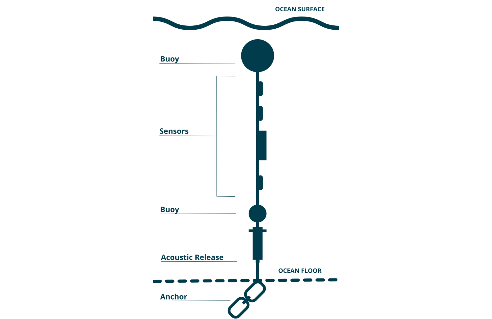

```{r setup, include=FALSE}
knitr::opts_chunk$set(echo = FALSE, dpi = 600)
```

```{r, echo=FALSE, message=FALSE, warning=FALSE}

library(canadianmaps)
library(dplyr)
library(ggplot2)
library(ggthemes)
library(ggspatial)
library(glue)
library(here)
library(knitr)
library(lubridate)
library(qaqcmar)
library(readr)
library(sf)
library(sensorstrings)
library(stringr)
library(tidyr)

source(here("functions/subchunkify.R"))
source(here("functions/report_helper_foos.R"))
source(here("functions/report_params.R"))
source(here("functions/iss_convert_depth_to_ordered_factor.R"))
source(here("functions/normalize_bbox_dims.R"))
```

```{r, import-strings-data}

# read all rds files for county and rbind together
dat_raw <- suppressMessages(
  ss_import_data(input_path = "R:/data_branches/inland_water_quality/processed_data/assembled_data", county = "all") %>%
    filter(station != "Sissiboo")
) 
# note: Sissiboo river data was processed twice and included in assembled datset twice under different names. Need to re-assemble without the "Sissiboo" station. Removing it here with a filter is a quick fix for now.


# filter dat for certain flag values, reorganize columns
dat <- dat_raw %>%
  qc_pivot_longer(qc_tests = "qc") %>%
  filter(qc_flag_value != "Fail")%>% # remove fail values
  filter(qc_flag_value != "Not Evaluated") %>% # remove not evaluated values
  qc_pivot_wider() %>%
  select(
    waterbody,
    station,
    latitude,
    longitude,
    deployment_range,
    string_configuration,
    sensor_type,
    sensor_serial_number,
    timestamp_utc,
    sensor_depth_at_deployment_m,
    any_of(vars),
    contains("flag")
  )

# unique waterbodies
waterbodies <- sort(unique(dat$waterbody))

# set formatting and caption settings
fig_caption <- " inland Water Quality data."
fig_map_caption <- "station location(s)."
table_caption <- "Deployment details for"

i = 1 # counter for table
k = 1 # counter for figure number
text_size <- 3.5
crs <- 4326

# dissolved oxygen units considerations
# should be irrelevant here because there is no DO data in mg per l at this time
# if("dissolved_oxygen_uncorrected_mg_per_l" %in% colnames(dat)) {
#   dat <- correct_do_data(dat)
#   DO_mgL <- TRUE
# } else DO_mgL <- FALSE

```


\newpage
# Introduction

River and lake systems provide critical habitat for some migratory marine species during key life stages, and have important impacts on coastal habitat at their outflow points. In Nova Scotia, there are are identified gaps in water quality data for these inland waterbodies [@RN24367].

The Centre for Marine Applied Research (CMAR) measures [essential ocean variables](https://goosocean.org/what-we-do/framework/essential-ocean-variables/) around the coast of Nova Scotia through the Coastal Monitoring Program. The Nova Scotia Department of Fisheries and Aquaculture started this program in 2015 to inform aquaculture site selection and management. CMAR assumed responsibility for the program in 2019 and has since expanded its scope and mandate. Recently, CMAR began monitoring on inland waterbodies in Nova Scotia to address data gaps. For more information on CMAR and the Coastal Monitoring Program, visit the [CMAR website](https://cmar.ca/). 

This document presents deployment details and summary figures of Water Quality data collected from rivers and lakes in Nova Scotia (Figure `r k`). The data are available for download from the Nova Scotia [Open Data Portal](https://data.novascotia.ca/Nature-and-Environment/Nova-Scotia-Inland-Water-Quality-Dataset/qaf8-y5x2/about_data). 

This document should be considered as a guide only. Data collection and retrieval are ongoing. The information may be revised pending ongoing data collection and analyses. 

```{r, NS-map, message=FALSE, warning=FALSE, error=FALSE, fig.width=6.5}

# NS county boundaries dataset
ns <- read_sf(here("data/merged_counties2/Merged_Counties2.shp")) %>% 
  na.omit() %>% 
  st_transform(crs = crs) 


# generate station location dataset
st_locations <- dat %>%
  distinct(latitude, .keep_all = TRUE)

st_locations_sf <- st_as_sf(st_locations,
                            coords = c("longitude", "latitude"),
                            crs = crs)

# river lines dataset 
river_lines_sf <- read_sf(
  here(
    "data/Mainstem_Lines_July23/Cleaned_Select_Named_Mainstems_ExportFeatures.shp"
  )
) %>%
  filter(rivname_1 %in% waterbodies) %>%
  filter(
    !uniqueid %in% c(
      "MID2",
      "SAL1",
      "SAL3",
      "SAL4",
      "SAL5",
      "SAL6",
      "NOR3",
      "NOR4",
      "NOR5",
      "LAW1"
    )
  )

#add piper lake and hourglass lake to river line shapefile
lake_names <- c("Hourglass Lake", "Piper Lake")

lakes <- st_locations_sf %>% filter(station %in% lake_names) %>%
  rename("rivname_1" = `station`) %>%
  mutate(
    "uniqueid" = "",
    "cgndb_key" = "",
    "county" = "",
    "du" = "",
    "primary_ws" = "",
    "significan" = "",
    "shape_leng" = ""
  )

lakes_formatted_sf <- lakes[c(
  "rivname_1",
  "uniqueid",
  "cgndb_key",
  "county",
  "du",
  "primary_ws",
  "significan",
  "shape_leng",
  "geometry"
)]

waterbody_locations_sf <- rbind(river_lines_sf, lakes_formatted_sf)

# generate a bounding box for the station locations map
ns_bbox <- ns %>%
  st_transform(crs = crs) %>%
  st_bbox() %>%
  normalize_bbox_dims()

west_buffer <- 1.2

# station locations map
ggplot() +
  geom_sf(data = ns) +
  geom_sf(data = river_lines_sf,
          linewidth = 0.7,
          color = "steelblue4") +
  geom_sf(data = st_locations_sf) +
  scale_x_continuous(limits = c(
        ns_bbox$xmin - west_buffer,
        ns_bbox$xmax)) +
  ggsflabel::geom_sf_text_repel(
    data = waterbody_locations_sf,
    aes(label = (rivname_1)),
    max.overlaps = 40,
    seed = 12,
    size = text_size,
    color = "black",
    bg.color = "white"
  ) +
  coord_sf(expand = TRUE) +
  annotation_scale(location = "br") +
  annotation_north_arrow(
    location = "tl",
    which_north = "true",
    height = unit(1, "cm"),
    width = unit(1, "cm")
  ) +
  theme_map() +
  theme(panel.border = element_rect(
    colour = "black",
    fill = NA,
    linewidth = 1
  ))

```

**Figure `r k`:** Inland Water Quality sampling station locations.

```{r,  message=FALSE, error=FALSE}
k = k + 1
```
<br>


\newpage
## Data Collection 

CMAR primarily collects inland Water Quality data using sensors secured inside a perforated PVC housing and anchored to the riverbed by a cinderblock (Figure `r k`). Sensors are usually deployed in 1.5m depths or shallower, and accessed by foot.


```{r, echo=FALSE, fig.width=10}
knitr::include_graphics("inland_river_deployment_graphic.png")
```

**Figure `r k`:** Image of a sensor deployed within a perforated PVC sensor housing attached to a cinderblock anchor.


```{r,  message=FALSE, error=FALSE}
k = k + 1
```


CMAR occasionally collects inland temperature and dissolved oxygen data using moorings referred to as "sensor strings". A typical sensor string configuration consists of a rope attached to the seafloor by an anchor and suspended by a sub-surface buoy, with sensors attached at various depths (Figure `r  k`). Alternatively, sensors may be attached to floating docks, surface buoys, equipment, or fixed structures (Table `r i`).

```{r, echo=FALSE, fig.width=8}

```

**Figure `r k`:** Example sensor string configuration (not to scale).

Sensors are typically deployed at a station for several months to a year, and data are logged every 1 minute to 1 hour. Sensors must be retrieved to offload the data. The retrieval method depends on the sensor configuration, and may include triggering an acoustic release, directly removing sensors from surface moorings, or removing shallow water bottom-mounted sensors on foot (Table `r i`). Interest-holder needs and characteristics of the station dictate the deployment design, including anchor weight, number and type of sensors, and configuration. 


\newpage

**Table `r i`:** Description of sensor deployment configurations.

| **Configuration** | **Description** |
|---|---|
|     Sub-surface buoy    |     Attached to sub-surface buoy. Typically has an acoustic release, but sometimes retrieved by diver or drag line. Does not float with the tide or water level fluctuations.    |
|     Surface buoy    |     Attached to a surface buoy. Floats with the tide or water level fluctuations.    |
|     Attached to fixed structure    |     Typically attached to a wharf, but may be attached to a bridge, cinderblock, or pole. Does not float with the tide or water level fluctuations.  |
|     Floating dock    |     Attached to a floating dock. Floats with the tide or water level fluctuations.    |
|     Unknown    |     Configuration not indicated in historical deployment log.    |


\newpage
## Quality Control

Automated Quality Control tests were applied to the data to identify outlying and unexpected observations. Following Quality Assurance/Quality Control of Real-Time Oceanographic Data (QARTOD) guidance, each data point was assigned a flag of “Pass”, “Fail”, “Suspect/Of Interest”, or “Not Evaluated” [@RN25922]. These automated flags were reviewed by human experts, and modified where necessary (e.g., upgrading “Suspect/Of Interest” flags to "Fail" if there were known issues with the deployment). 

Observations flagged as “Pass” passed all tests and were included in the figures below. “Suspect/Of Interest” dissolved oxygen observations may be indicative of sensor biofouling. “Suspect/Of Interest” temperature observations may be indicative of sensor exposure to air during periods of low water, or rapid changes in temperature due to a rainfall event. Most of the flagged "Suspect/Of Interest" observations were considered "Of Interest" and are shown in the figures below. Observations that failed any test were considered poor quality data and excluded from the figures.

Some tests cannot be applied to certain observations, which were flagged as “Not Evaluated”. These data points were not included in the figures. 

Removing flagged observations can result in patchy time series. The full inland Water Quality Datasets, including Quality Control flags, can be downloaded from the [Nova Scotia Open Data Portal](https://data.novascotia.ca/browse?q=coastal+monitoring+program&sortBy=relevance&limitTo=datasets&tags=water+quality). Data gaps can also be caused by battery failure, delays between retrieval and re-deployment, and accidental or intentional interference with equipment.

Note that some sensors may drift over time. The existing Quality Control tests do not explicitly detect sensor drift, and users should review all data prior to use.

For more technical details about the Quality Control tests, visit the CMAR [Data Governance website](https://dempsey-cmar.github.io/cmp-data-governance/pages/cmp_about.html).


\newpage
# Inland Water Quality Data

Inland Water Quality data is presented by waterbody. For each waterbody, there is a table of deployment details followed by figures showing the station locations and the data at each station. Note the differences in scales between figures (x-axis, y-axis, and colour). Some sensors may have been deployed in tributaries of the named deployment waterbody. 

```{r, report-body, fig.width = 8.5, results = 'hide',  results ='asis', message=FALSE, warning=FALSE}

for(i in seq_along(waterbodies)) {

  k = k + 1
  
  waterbody_i <- waterbodies[i]
  
  dat_i <- dat %>% filter(waterbody == waterbody_i)
  
  stations <- sort(unique(dat_i$station))
  
  if(i > 1) cat("\n\n\\pagebreak\n")
  
  cat('\n##', waterbody_i, '\n')
  
  cat('\n')
  
  # waterbody table
  table_i <- ss_write_report_table(dat_i, keep_waterbody = FALSE)
  
  i_table <- i + 1
  
  print(kable(
    table_i,
    align = "c",
    caption = glue("**Table {i_table}:** {table_caption} {waterbody_i}.")
  ))
  
  cat('\n')
  
  # filter to relevant river
  # note: round hill river points are outside the bbox for the river line
  weird_stations <- c(lake_names, "Round Hill River") 
  
  if (waterbody_i %in% weird_stations) {
    st_locations_sf_i <- st_locations_sf %>%
      filter(waterbody == waterbody_i)
    
    # bounding box around river line
    river_bbox <- st_locations_sf_i %>%
      st_transform(crs = crs) %>%
      st_bbox() %>%
      normalize_bbox_dims()
    
    river_buffer <- 0.38
    
    # waterbody map
    river_map <- ggplot() +
      geom_sf(data = ns, linewidth = 0.25) +
      scale_x_continuous(limits = c(
        river_bbox$xmin - river_buffer,
        river_bbox$xmax + river_buffer
      )) +
      scale_y_continuous(limits = c(
        river_bbox$ymin - river_buffer,
        river_bbox$ymax + river_buffer
      )) +
      coord_sf(expand = FALSE,
               lims_method = "geometry_bbox",
               default_crs = NULL) +
      theme_map() +
      theme(
        panel.border = element_rect(
          colour = "black",
          fill = NA,
          linewidth = 0.5
        ),
        axis.title = element_blank(),
        legend.position = "none"
      ) +
      geom_sf(data = st_locations_sf_i) +
      annotation_scale(location = "br") +
      annotation_north_arrow(
        location = "tl",
        which_north = "true",
        height = unit(1, "cm"),
        width = unit(1, "cm")
      ) +
      ggsflabel::geom_sf_text_repel(
        data = st_locations_sf_i,
        aes(label = (station)),
        max.overlaps = 40,
        seed = 12,
        size = text_size,
        color = "black",
        bg.color = "white"
      )
    
    print(river_map)
    
    # figure caption
    i_figure <- k + 1
    
    fig_caption_i <-  glue("**Figure {i_figure}:** {waterbody_i} {fig_map_caption}")
    
    cat(fig_caption_i, '\n')
    
    cat('\n')
    
  } else{
    river_lines_sf_i <- river_lines_sf %>%
      filter(rivname_1 == waterbody_i) %>%
      mutate(fill = 1)
    
    st_locations_sf_i <- st_locations_sf %>%
      filter(waterbody == waterbody_i)
    
    # bounding box around river line
    river_bbox <- river_lines_sf_i %>%
      st_transform(crs = crs) %>%
      st_bbox() %>%
      normalize_bbox_dims(
      )
    
    
    river_buffer <- river_lines_sf_i$shape_leng * 0.15
    
    # waterbody map
    river_map <- ggplot() +
      geom_sf(data = ns, linewidth = 0.25) +
      scale_x_continuous(limits = c(
        river_bbox$xmin - river_buffer,
        river_bbox$xmax + river_buffer
      )) +
      scale_y_continuous(limits = c(
        river_bbox$ymin - river_buffer,
        river_bbox$ymax + river_buffer
      )) +
      coord_sf(expand = FALSE,
               lims_method = "geometry_bbox",
               default_crs = NULL) +
      theme_map() +
      theme(
        panel.border = element_rect(
          colour = "black",
          fill = NA,
          linewidth = 0.5
        ),
        axis.title = element_blank(),
        legend.position = "none"
      ) +
      geom_sf(data = river_lines_sf_i, color = "#00a4e4") +
      geom_sf(data = st_locations_sf_i) +
      annotation_scale(location = "br") +
      annotation_north_arrow(
        location = "tl",
        which_north = "true",
        height = unit(1, "cm"),
        width = unit(1, "cm")
      ) +
      ggsflabel::geom_sf_text_repel(
        data = st_locations_sf_i,
        aes(label = (station)),
        max.overlaps = 40,
        seed = 12,
        size = text_size,
        color = "black",
        bg.color = "white"
      )
    
    print(river_map)
    
    # figure caption
    i_figure <- k + 1
    fig_caption_i <-  glue("**Figure {i_figure}:** {waterbody_i} {fig_map_caption}")
    
    cat(fig_caption_i, '\n')
    
    cat('\n')
    
  }

  
  # plot for each station
  for (j in seq_along(stations)) {
    
    station_j <- stations[j] # station of interest
    
    #if(j > 1) cat("\n\n\\pagebreak\n")
    
    cat('\n###', station_j, '\n')
    
    # subset data to station of interest
    dat_j <- dat_i %>%
      filter(station == station_j) %>%
      iss_convert_depth_to_ordered_factor() %>%
      select(!contains("flag"))
    
    # figure
    p <- ss_ggplot_variables(dat_j, # yaxis_newline = FALSE,
                             color_col = "sensor_depth_at_deployment_m")
    
    print(p)
    
    # figure caption
    k = k + 1
    i_figure <- k + 1
    fig_caption_i <-  glue("**Figure {i_figure}:** {station_j} {fig_caption}")
    
    cat(fig_caption_i, '\n')
    
    cat('\n')
 }
}


```


\newpage
#	Data Acknowledgement 

CMAR aims to prioritize data collection and processing efforts that best serve coastal interest holders. If you use this Coastal Monitoring Program Water Quality data in a project or for decision making, please complete our [anonymous questionnaire](https://docs.google.com/forms/d/1RmHN1vDaM0dXqKFKy8V-traIoubdw1pqMDKVtPmWDHc/edit) with your feedback. Please cite the report and/or datasets used.

<br>

# Document History


```{r}
i <- i + 1

# note: in the future, import the document history as a separate file for ease of updating

# i <- i_table + 1
# 
# params$doc.hist %>% 
#   select(-c(County, Notes)) %>% 
#   kable(
#     align = "ccl", caption = glue("Table {i}: Document history.")
#   )
```

**Table `r i`:** Description of sensor string configurations.

| **Version** | **Date** | **Amendments** |
|---|---|---|
|     V1    |     2025-10-20    |     New document    |    

<br>

# References

