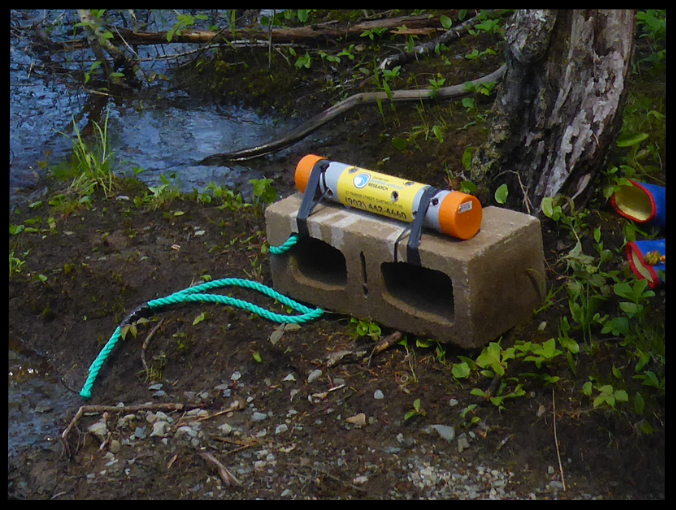

```{r setup, include=FALSE}
knitr::opts_chunk$set(echo = FALSE, dpi = 600)
```

```{r, echo=FALSE, message=FALSE, warning=FALSE}

library(canadianmaps)
library(docalcs)
library(dplyr)
library(ggplot2)
library(ggthemes)
library(ggsflabel)
library(ggspatial)
library(glue)
library(here)
library(knitr)
library(lubridate)
library(qaqcmar)
library(readr)
library(sf)
library(sensorstrings)
library(stringr)
library(tidyr)

source(here("functions/subchunkify.R"))
source(here("functions/import_map_params.R"))
source(here("functions/report_helper_foos.R"))
source(here("functions/report_params.R"))

#county <- params$county
```

```{r, import-strings-data}

# read all rds files for county and rbind together
dat_raw <- suppressMessages(ss_import_data(
  input_path = "R:/data_branches/inland_water_quality/processed_data/assembled_data",
  county = "all"))

if(!("lease" %in% colnames(dat_raw))) {
  dat_raw <- mutate(dat_raw, lease = NA_character_)
}

# keep salinity obs flagged 1, 2, 3; will filter out 3's for all except monks head below
if(county == "Antigonish") {
  keep_salinity <- c(1, 2, 3, NA)
} else {
  keep_salinity <- c(1, 2, NA)
}

dat <- dat_raw %>% 
  qc_pivot_longer() %>% 
  qc_filter_summary_flags(keep_salinity_psu = keep_salinity) %>% 
  filter(qc_flag_value != 2) %>% 
  qc_pivot_wider() %>% 
  select(
    waterbody, station, lease, latitude, longitude,
    deployment_range, string_configuration,
    sensor_type, sensor_serial_number, sensor_depth_at_low_tide_m, timestamp_utc,
    any_of(vars),
    contains("flag")
  )

# unique waterbodies
waterbodies <- sort(unique(dat$waterbody))

fig_caption <- " water quality data."
table_caption <- "Deployment details for"

i = 1 # counter for table
k = 1 # counter for figure number
text_size <- 3.5
crs <- 4326

# dissolved oxygen units considerations
if("dissolved_oxygen_uncorrected_mg_per_l" %in% colnames(dat)) {
  dat <- correct_do_data(dat)
  DO_mgL <- TRUE
} else DO_mgL <- FALSE

```


\newpage
# Introduction

The Centre for Marine Applied Research (CMAR) measures [essential ocean variables](https://goosocean.org/what-we-do/framework/essential-ocean-variables/) around the coast of Nova Scotia through the Coastal Monitoring Program. The Nova Scotia Department of Fisheries and Aquaculture started this program in 2015 to inform aquaculture site selection and management. CMAR assumed responsibility for the program in 2019 and has since expanded its scope and mandate. For more information on CMAR and the Coastal Monitoring Program, visit the [CMAR website](https://cmar.ca/). Recently, CMAR expanded the program to include monitoring on inland waterbodies in Nova Scotia.

This document presents deployment details and summary figures of inland Water Quality data collected in Nova Scotia (Figure `r k` and Figure `r k+1`). The data are available for download from the Nova Scotia [Open Data Portal](https://data.novascotia.ca/browse?q=coastal+monitoring+program&sortBy=relevance&limitTo=datasets&tags=water+quality) and from the ERDAPP server through the [Canadian Integrated Ocean Observing System](https://catalogue.cioosatlantic.ca/dataset?q=cmar). 

This document should be considered as a guide only, since data collection and retrieval are ongoing. The information may be revised pending ongoing data collection and analyses. 

```{r, NS-map, message=FALSE, warning=FALSE, error=FALSE, fig.width=8}

# NS county boundaries
ns <- read_sf(here("data/merged_counties2/Merged_Counties2.shp")) %>% 
  na.omit() %>% 
   mutate(
    col_county = if_else(County == county, 1, 0),
    col_county = ordered(factor(col_county), levels = c(1, 0))
  ) %>% 
  st_transform(crs = crs) 

bbox <- st_bbox(ns)

nb_pei <- filter(PROV, PT == "NB"|PT=="PE") %>%
  st_transform(crs = crs) %>% 
  mutate(
    col_county = 0, 
    col_county = ordered(factor(col_county), levels = c(1, 0))
  )

can <- bind_rows(
  ns %>% st_simplify(dTolerance = 1000), 
  nb_pei
) %>% 
  st_crop(bbox) 

ggplot() +
  geom_sf(data = can, aes(fill = col_county)) +
  scale_fill_manual(values = c("#1B9E77", "grey90")) +
  theme_map() +
  coord_sf(expand = TRUE) +
  theme(
    panel.border = element_rect(colour = "black", fill = NA, linewidth = 1),
    text = element_text(size = 12),
    axis.title = element_blank(),
    legend.position = "none"
  )

```

**Figure `r k`:** `r county` County (green).

```{r,  message=FALSE, error=FALSE}
k = k + 1
```


```{r, county-map, message=FALSE, error=FALSE, warning=FALSE, fig.width=8}

if(county == "Guysborough") text_size <- 3

dummy_coords <- import_map_params(county)

# extract unique station locations and convert to sf object
stations_sf <- dat %>%
  sensorstrings::ss_write_report_table(keep_waterbody = TRUE) %>%
  mutate(
    Station = case_when(
      str_detect(Station, "Roy Island") ~ "Roy Island 1, 2, 3", 
      str_detect(Station, "Antigonish") ~ "Antigonish 1, 2, 3", 
      str_detect(Station, "Tracadie") ~ "Tracadie 1, 2, 3",
      str_detect(Station, "McNabs Point") ~ "McNabs Point 1, 2, 3",
      TRUE ~ Station)
  ) %>% 
  select(Waterbody, Station, Latitude, Longitude) %>%
  distinct(Station, .keep_all = TRUE) %>%
  st_as_sf(
    coords = c("Longitude", "Latitude"), remove = FALSE,
    crs = crs, agr = "constant"
  )

county_sf <- ns %>% 
  st_crop(dummy_coords) 

# extend xlims because shapefile extents make the figure crowded
if(county == "Digby") {
  x_lims <-  c(-66.7, -65.4)
} else x_lims <- NULL

if(county == "Halifax") {
  force_fact <- 40
} else if (county == "Richmond") {
  force_fact <- 23
} else if (county == "Inverness") {
  force_fact <- 27
} else force_fact <- 50


ggplot() +
  geom_sf(data = county_sf) +
  geom_sf(data = stations_sf) +
  ggsflabel::geom_sf_text_repel(
    data = stations_sf, aes(label = Station), 
    force = force_fact, max.overlaps = 40,  seed = 12,
    size = text_size, color = "black", bg.color = "white"
  ) +
  coord_sf(expand = FALSE, xlim = x_lims) +
  annotation_scale(location = "br") +
  annotation_north_arrow(
    location = "tl", which_north = "true",
    height = unit(1, "cm"),
    width = unit(1, "cm")
  ) +
  theme_map() +
  theme(
    panel.border = element_rect(colour = "black", fill = NA, size = 1)
  )
```	
<br>

**Figure `r k`:** Sampling stations in `r county` County.

```{r}
k = k+1
```

\newpage
## Data Collection 

CMAR collects temperature data using sensors secured inside a perforated PVC housing and anchored to the riverbed by a cinderblock (Figure `r k`). Sensors are usually deployed in 1m depths or shallower, and accessed by foot.

CMAR occasionally collects temperature, dissolved oxygen, and salinity data using moorings referred to as "sensor strings". A typical sensor string configuration consists of a rope attached to the seafloor by an anchor and suspended by a sub-surface buoy, with sensors attached at various depths (Figure `r  k`). Alternatively, sensors may be attached to floating docks, surface buoys, equipment, or fixed structures (Table `r i`). 

```{r, echo=FALSE, fig.width=8}

```

**Figure `r k`:** Example sensor string configuration (not to scale).

Sensor strings are typically deployed at a station for several months to a year, and data are logged every 1 minute to 1 hour. Sensors must be retrieved to offload the data. The retrieval method depends on the sensor configuration, and may include triggering an acoustic release, directly removing sensors from surface moorings, or employing divers or grappling methods (Table `r i`).

To build long term data series, key stations around the province have multiple consecutive deployments. At these stations, new sensors are deployed during the same field trip that the previous sensors are retrieved. Other stations may have fewer deployments due to reduced interest in the area or operational constraints. New stations are added based on interest-holder requests or to fill spatial gaps.


\newpage

**Table `r i`:** Description of sensor string configurations.

| **Configuration** | **Description** |
|---|---|
|     Sub-surface buoy    |     Attached to sub-surface buoy. Typically has an acoustic release, but sometimes retrieved by diver or drag line. Does not float with the tide.    |
|     Surface buoy    |     Attached to a surface buoy. Floats with the tide.    |
|     Attached to gear    |     Typically attached to aquaculture gear[^1], but may be attached to another structure. Floats with the tide.  |
|     Attached to fixed structure    |     Typically attached to a wharf, but may be attached to a bridge or pole. Does not float with the tide.  |
|     Floating dock    |     Attached to a floating dock. Floats with the tide.    |
|     Unknown    |     Configuration not indicated in historical deployment log.    |

[^1]: Some aquaculture gear may be sunk to the bottom during winter or extreme weather conditions like hurricanes, and so the sensor depth may change during the deployment. This change would likely be flagged by quality control processes, but it is recommended that users critically review data from these deployments.

Interest-holder needs and characteristics of the station dictate the string design, including anchor weight, number and type of sensors, and configuration (Table `r i`). Sensor strings are generally deployed 200 m to 1000 m from shore, in depths up to 75 m. Historically, strings were deployed with only temperature sensors, but more recently a dissolved oxygen sensor is often attached 5 m below the surface. At the request of industry, salinity sensors are also included at stations near proposed and existing shellfish aquaculture leases. Some of the sensors used to measure these variables also measure sensor depth. CMAR has processed and published this opportunistic depth data with the Water Quality datasets, and measured sensor depth is included in the figures below.

## Quality Control

Automated Quality Control tests were applied to the data to identify outlying and unexpected observations. Following Quality Assurance/Quality Control of Real-Time Oceanographic Data (QARTOD) guidance, each data point was assigned a flag of “Pass”, “Fail”, “Suspect/Of Interest”, or “Not Evaluated” [@RN25922]. These automated flags were reviewed by human experts, and modified where necessary (e.g., upgrading “Suspect/Of Interest” flags to "Fail" if there were known issues with the deployment). Observations flagged as “Pass” passed all tests and were included in the figures below. Observations that failed any test were considered poor quality data and excluded from the figures.

Observations flagged as “Suspect/Of Interest” were reviewed by human experts. “Suspect/Of Interest” dissolved oxygen observations may be indicative of biofouling and were excluded from the figures unless otherwise noted. “Suspect/Of Interest” salinity observations were usually considered "Suspect" and excluded unless otherwise noted. Most of the temperature and measured depth observations were considered "Of Interest" and are shown in the figures below. 

Some tests cannot be applied to certain observations, which were flagged as “Not Evaluated”. These data points were not included in the figures. 

Removing flagged observations can result in patchy time series, especially for dissolved oxygen data. The full `r county` County Water Quality Data, including Quality Control flags, can be downloaded from the [Open Data Portal](https://data.novascotia.ca/browse?q=coastal+monitoring+program&sortBy=relevance&limitTo=datasets&tags=water+quality) or the
[Canadian Integrated Ocean Observing System](https://catalogue.cioosatlantic.ca/dataset?q=cmar). Data gaps can also be caused by battery failure, delays between retrieval and re-deployment, and accidental or intentional interference with equipment.

Note that some sensors (dissolved oxygen and salinity) may drift over time. The existing Quality Control tests do not explicitly detect sensor drift, and users should review all data prior to use.

For more technical details about the Quality Control tests, visit the CMAR [Data Governance website](https://dempsey-cmar.github.io/cmp-data-governance/pages/cmp_about.html).

`r if(DO_mgL){"## Dissolved Oxygen \nDissolved oxygen was measured in units of percent saturation or mg/L, depending on the deployment. Measurements in mg/L were corrected for salinity using the Garcia-Gordon (1992) salinity correction factor [@RN24366] with a salinity value of 30.6 practical salinity units (based on available data for the region). This correction factor is not required for values recorded in percent saturation. The correction factor calculations are available in the CMAR R package [docalcs](https://github.com/dempsey-CMAR/docalcs)."}`

\newpage
# `r county` County Water Quality Data

Water Quality data is presented by waterbody. For each waterbody, there is a table of deployment details followed by figures showing the data at each station. Note the differences in scales between figures (x-axis, y-axis, and colour).

```{r, report-body, fig.width = 8.5, results = 'hide',  results ='asis', message=FALSE}

for(i in seq_along(waterbodies)){

  waterbody_i <- waterbodies[i]
  dat_i <- dat %>% filter(waterbody == waterbody_i)

  stations <- sort(unique(dat_i$station))
  
  cat('\n##', waterbody_i, '\n')

  cat('\n')

  # waterbody table
  table_i <- ss_write_report_table(dat_i, keep_waterbody = FALSE)

  i_table <- i + 1
  print(
    kable(table_i, align = "c",
          caption = glue("**Table {i_table}:** {table_caption} {waterbody_i}.")
    )
  )
  
  cat('\n')
  
  # plot for each station
  for(j in seq_along(stations)){

    k = k + 1
    station_j <- stations[j] # station of interest

    # subset data to station of interest
    dat_j <- dat_i %>% 
      filter(station == station_j) %>%
      ss_convert_depth_to_ordered_factor()
    
    # filter out salinity obs flagged 3 from all stations except Monks Head
    if(county == "Antigonish" & station_j != "Monks Head") {
      dat_j <- dat_j %>% 
        qc_pivot_longer(qc_tests = "qc") %>% 
        qc_filter_summary_flags() %>% 
        qc_pivot_wider()
    }
    
    # filter in Of Interest DO data at 60 m; filter out Suspect measured depth
    if(county == "Guysborough" & station_j == "Tickle Island 1") {
      dat_j <- filter_tickle_island_1(dat_j)
    }
    
    dat_j <- dat_j %>% select(-contains("flag"))
    
    # y-limts for DO
    if(station_j %in% keep_sus_do){
      ylims_do = FALSE     # default ggplot ylimits
    } else ylims_do = TRUE # standard ylimits
    
    # y-limts for SAL
    if(station_j %in% keep_sus_sal){
      ylims_sal = FALSE     # default ggplot ylimits
    } else ylims_sal = TRUE # standard ylimits
    
    # height of figure j
    h <- calc_fig_height(dat_j, h1 = 2.4)

    # figure    
    #p <- ss_ggplot_variables(dat_j, superchill = FALSE)
    p <- ss_plot_variables(
      dat_j,
      standard_do_ylims = ylims_do,
      standard_sal_ylims = ylims_sal,
      yaxis_newline = FALSE
    )
    
    cat('\n###', station_j, '\n')
     
    subchunkify(p, fig_height = h, fig_width = 8.5)
    
    # figure caption    
    fig_caption_j <-  glue("**Figure {k}:** {station_j}{fig_caption}")
    
    if(station_j %in% c(keep_sus_do)) {
      fig_caption_j <-glue_do_fig_caption(fig_caption_j, station_j)
    }
    
    if(station_j %in% c(keep_sus_sal)) {
      fig_caption_j <- glue_sal_fig_caption(fig_caption_j)
    }
    
    cat(fig_caption_j, '\n')
    
    cat('\n')
  }
}

```

\newpage
#	Data Acknowledgement 

CMAR aims to prioritize data collection and processing efforts that best serve coastal interest holders. If you use this Coastal Monitoring Program Water Quality data in a project or for decision making, please complete our [anonymous questionnaire](https://docs.google.com/forms/d/1RmHN1vDaM0dXqKFKy8V-traIoubdw1pqMDKVtPmWDHc/edit) with your feedback. Please cite the report and/or datasets used.

# Document History

```{r}
i <- i_table +1

params$doc.hist %>% 
  select(-c(County, Notes)) %>% 
  kable(
    align = "ccl", caption = glue("Table {i}: Document history.")
  )
```
<br>

# References

